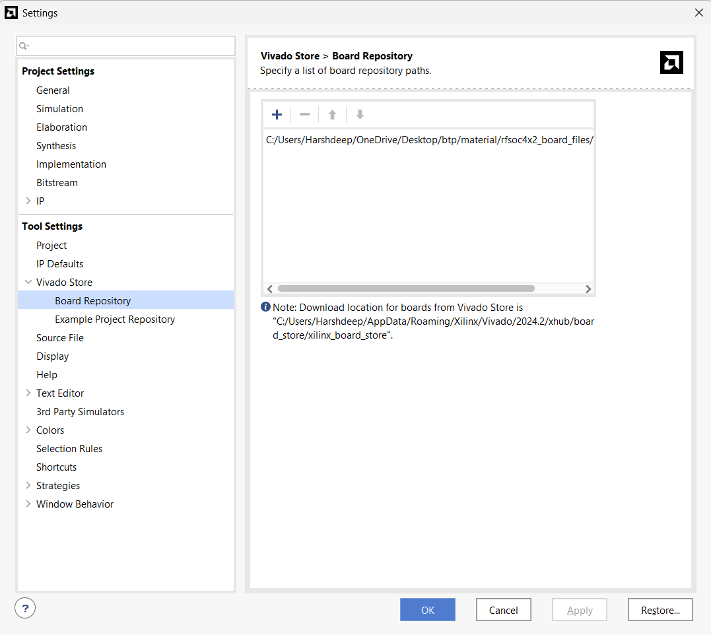
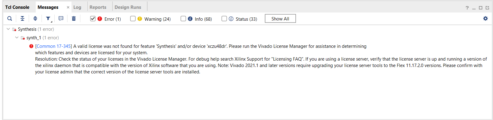
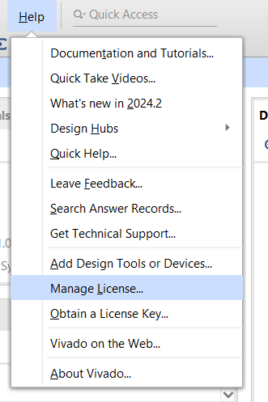
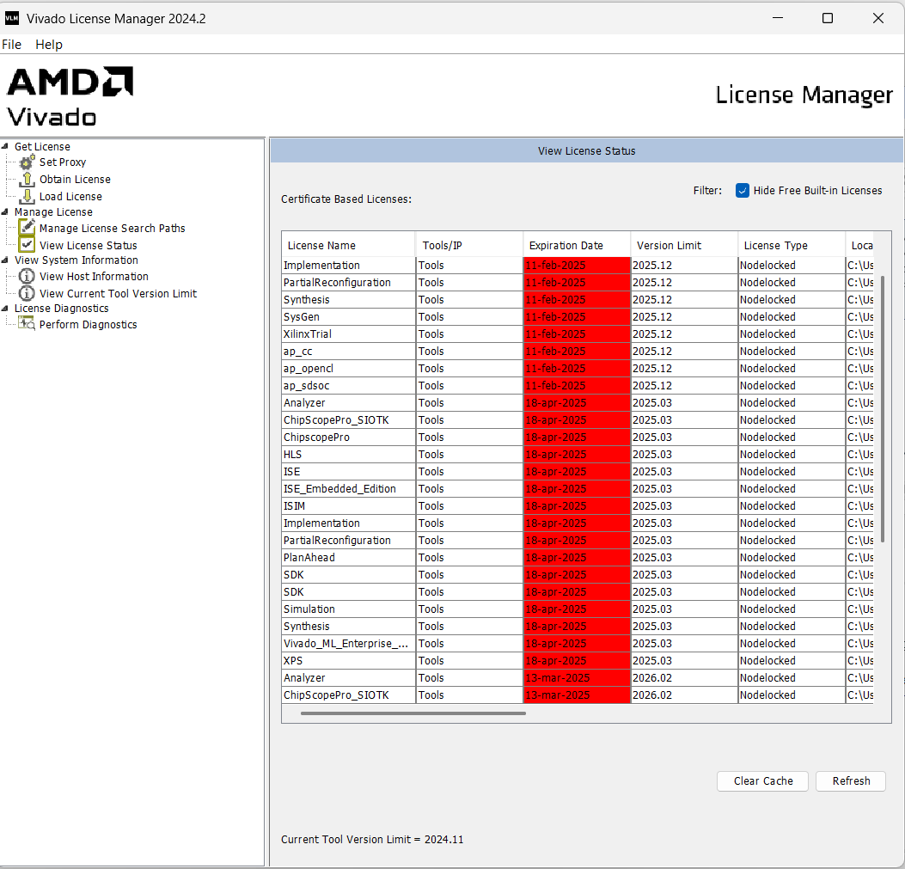
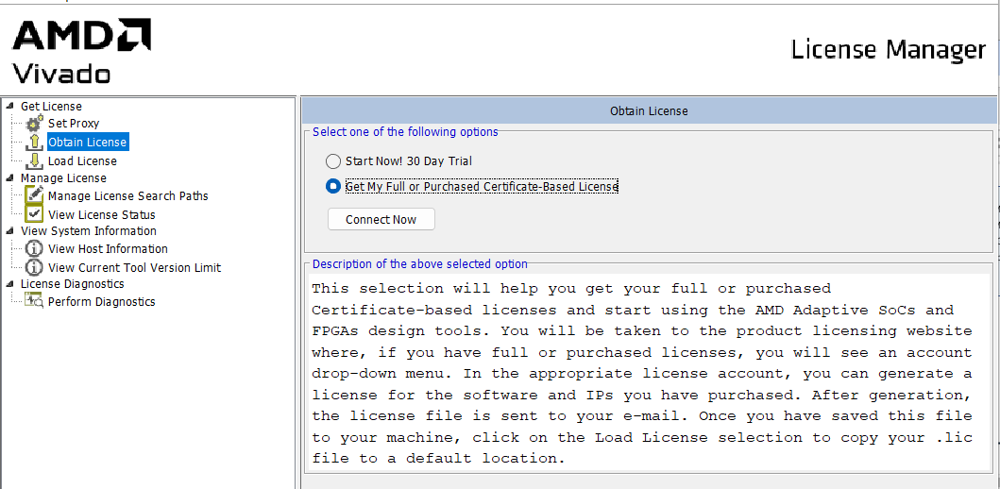
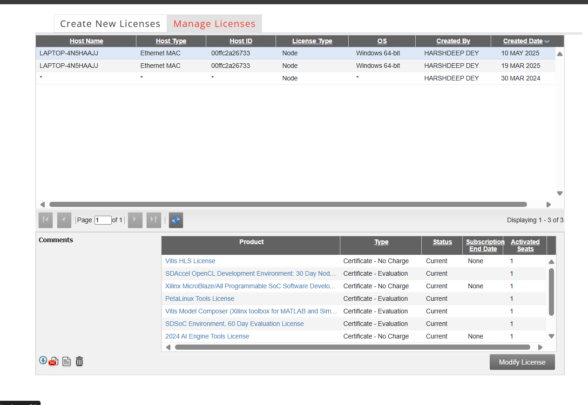
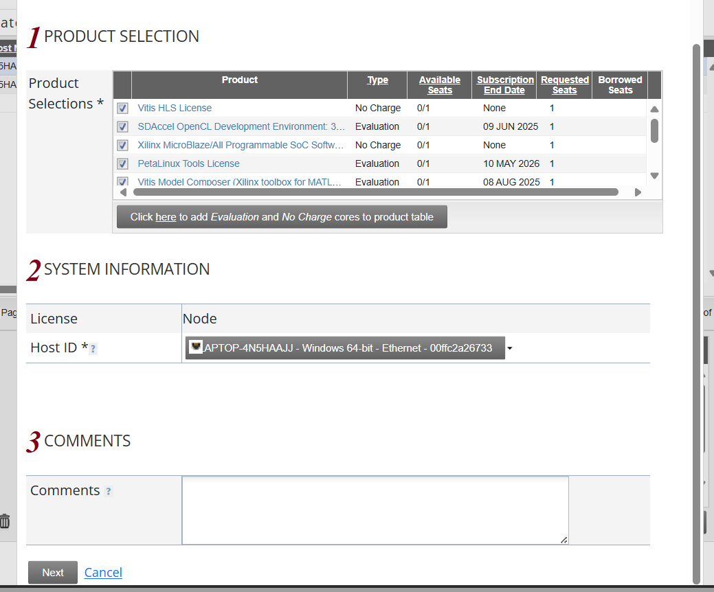
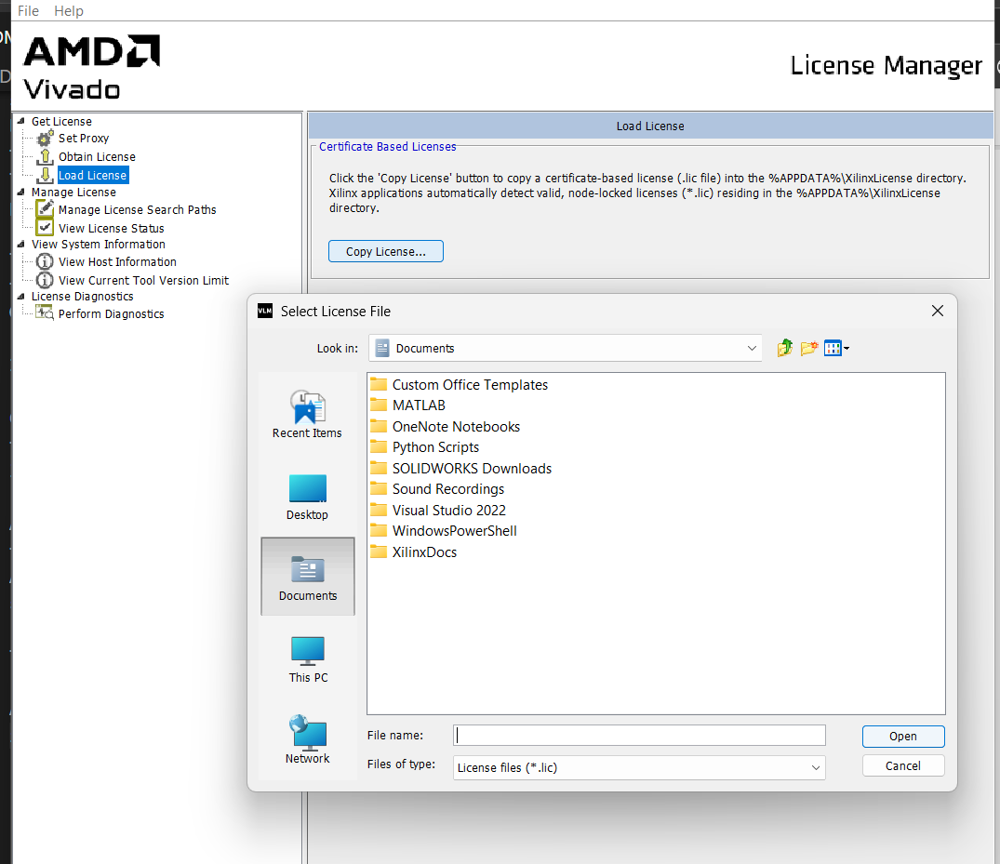

Once the board file is downloaded. Add its path on seetings>tools settings>> Vivado store>>Board repository.

Once the path is added , restart the Vivado.

Now when you reach the board adding stage after creating a new project, you could be able to see above interface with rfsoc4x2 board.
This ends the basic board setting.
One might face license issue while synthesising some design on this board. There exists a subtle loop hole to exploit
These is the error message that might pop up

To get around it one must follow the following steps
One has to go to Help>>Manage license

It will load the following interface

Click obtain license option>>Get my full purchased certificate based license>> process now

A portal will open up to sign in and fill some required fields.
After that go to manage license section and click modify license.

Tick all the fileds and click next

A .lic file will be sent to your mail id. Upload that .lic file in vivado

Thats it you are good to go again