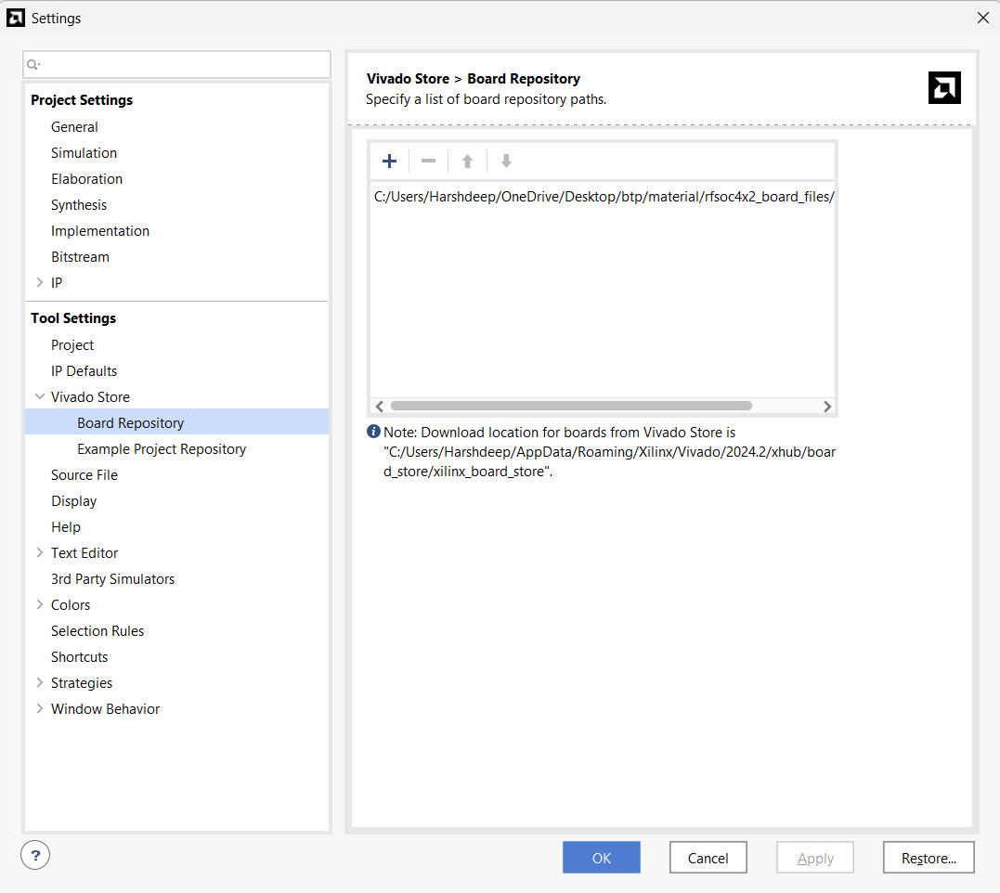
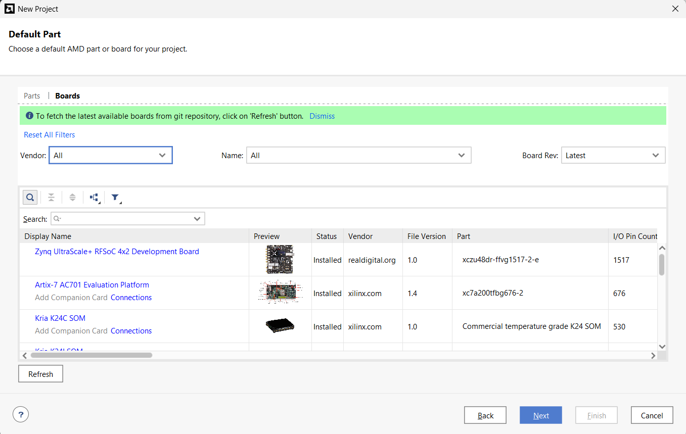
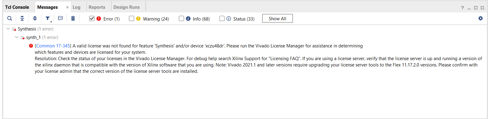
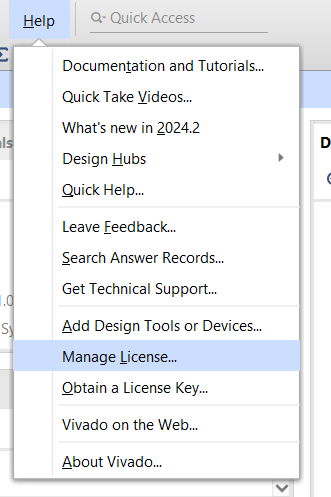
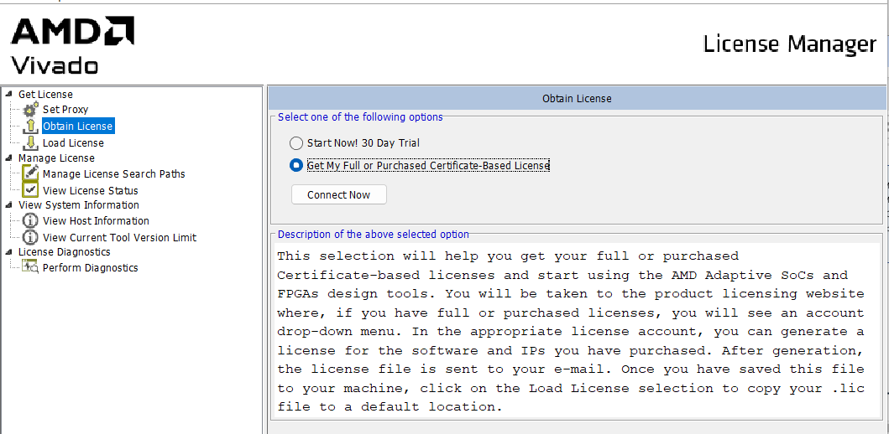
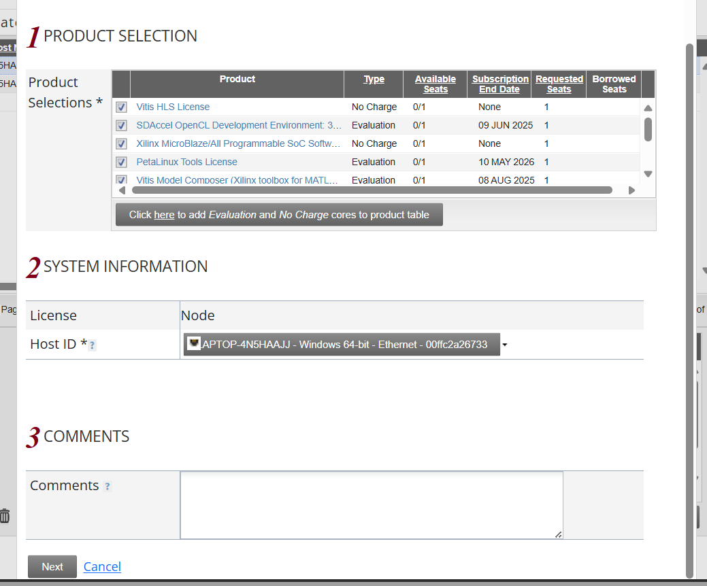
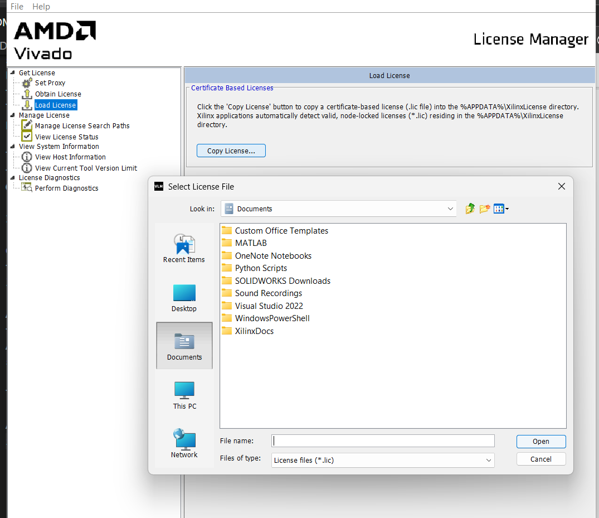

## Setting Up the Board in Vivado

### Step 1: Add Board Repository Path
Once the board file is downloaded, add its path in:

**Settings > Tools Settings > Vivado Store > Board Repository**

### Step 2: Restart Vivado
Once the path is added, restart Vivado.

### Step 3: Verify Board in Project Setup
When you reach the board selection stage during new project creation, you should see an interface like this with the `rfsoc4x2` board listed.

This completes the basic board setup.

---

## Handling License Issues in Vivado

You might face a license issue while synthesizing designs for this board. Here's a workaround.

### Sample Error Message
This is an example of the error message that might appear:

### Step 1: Open License Manager
Go to:

**Help > Manage License**

This will load the following interface:

### Step 2: Obtain License
Click:

**Obtain License > Get my full purchased certificate-based license > Process Now**

A portal will open asking you to sign in and fill in some required details.

### Step 3: Modify License
Once done, go to the **Manage License** section and click **Modify License**.

Tick all the fields and click **Next**.

You will receive a `.lic` file in your email.

### Step 4: Upload License in Vivado
Upload that `.lic` file in Vivado.

---

## ✅ You're All Set!
That's it — you're good to go again!
